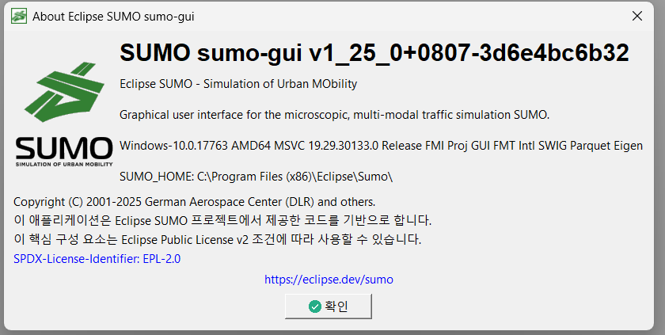

## Eclipse SUMO v1.26.0 한국어 공식 지원

2026년 1월 29일 릴리즈된 [Eclipse SUMO v1.26.0](https://sumo.dlr.de/docs/ChangeLog.html)에 한국어가 공식 지원 언어로 추가되었습니다.

> Started Korean Language translation [#17420]
>
> — [Eclipse SUMO v1.26.0 ChangeLog](https://sumo.dlr.de/docs/ChangeLog.html)

[이전 포스트](/blog/sumo-korean-weblate/)에서 Weblate 한국어 번역 페이지 개설 소식을 전해드렸는데, 그 번역이 v1.26.0에 정식으로 반영되었습니다.
 

## 경과

1. GitHub에 한국어 번역 추가를 요청하는 [Issue](https://github.com/eclipse-sumo/sumo/issues/17420)를 등록
2. eclipse-sumo 측에서 Weblate에 한국어 번역 페이지를 개설
3. Weblate를 통한 번역 진행
4. v1.25.0 Nightly Build에서 한국어 번역이 먼저 추가
5. Version 1.26.0 (2026.01.29) 릴리즈부터 공식 지원

<figure>
  
  <figcaption>SUMO v1.25.0 Nightly Build - 한국어 적용 화면</figcaption>
</figure>

gui쪽에 대해서 대부분의 번역을 마쳐둔 상태이나, 여전히 번역이 필요한 문자열이 많이 남아있습니다.
저는 SUMO의 일부 기능과 라이브러리 위주로 사용해왔기 때문에 전체 기능에 대한 번역에 어려움이 있습니다.
아직 영어가 서툰 junior, student, amatuer researcher 등 후기지수들을 위해 많은 참여 바랍니다.
SUMO를 사용해보신 분들이라면, 본인이 잘 아는 기능의 번역 몇 줄만으로도 큰 기여가 됩니다.
 

## 번역 참여

Weblate를 통해 누구나 웹 브라우저에서 번역에 참여할 수 있습니다.

| 컴포넌트 | 설명 | 번역 페이지 |
|---------|------|-----------|
| SUMO GUI / Netedit | GUI 및 네트워크 편집기 | [Korean](https://hosted.weblate.org/projects/eclipse-sumo/sumo-gui-netedit/ko/) |
| Applications | CLI 애플리케이션 | [Korean](https://hosted.weblate.org/projects/eclipse-sumo/applications/ko/) |
| Python tools | Python 도구 | [Korean](https://hosted.weblate.org/projects/eclipse-sumo/python-tools/ko/) |
| Glossary | 용어집 | [Korean](https://hosted.weblate.org/projects/eclipse-sumo/glossary/ko/) |

 

## 관련 링크

- [Eclipse SUMO 공식 사이트](https://eclipse.dev/sumo/)
- [Eclipse SUMO v1.26.0 ChangeLog](https://sumo.dlr.de/docs/ChangeLog.html)
- [GitHub Issue #17420](https://github.com/eclipse-sumo/sumo/issues/17420)
- [Weblate 참여 페이지](https://hosted.weblate.org/engage/eclipse-sumo/)
- [이전 포스트: Weblate 한국어 번역 페이지 개설](/blog/sumo-korean-weblate/)
