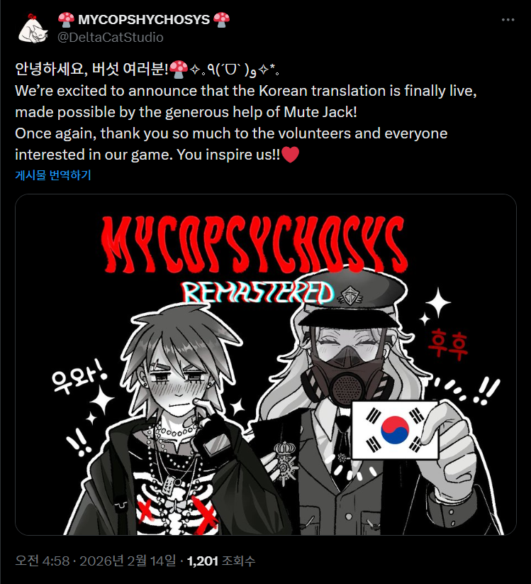

## 한국어 공식 지원

2026년 2월 14일, [DeltaCatStudio](https://www.deltacatstudio.com/)의 **Mycopsychosys: Remastered**에 한국어가 공식 언어로 추가되었습니다.
번역에 관심을 가져주시고, 정식 편입을 결정해주신 DeltaCatStudio 개발진분들께 감사드립니다.

<blockquote>
안녕하세요, 버섯 여러분! 
We're excited to announce that the Korean translation is finally live, made possible by the generous help of Mute Jack! 
Once again, thank you so much to the volunteers and everyone interested in our game. You inspire us!! 
— <a href="https://x.com/DeltaCatStudio/status/2022400104309883010">@DeltaCatStudio</a>
</blockquote>

이전에 비공식 패치/번역 스크립트 형태로 배포/공개했던 비공식 한국어 번역이 게임에 정식으로 편입되었습니다.
이제 게임을 설치하면 환경설정에서 한국어를 선택할 수 있으며, 별도의 패치 없이 한국어로 플레이할 수 있습니다.
` `
생전 처음보는 형태의 배치파일 돌려보겠다고 고생하신 선구자분들 모두 고생 많으셨습니다.
사실 Batch형태로 배포하는게 여러분들께 생소하고, 불편한건 알고 있고, python이나 Cpp로 패치기를 다시 만들 생각도 있기는 했습니다만, 주말에 연구돌리면서 잠깐씩 짬나는 시간에 조금씩 만든거라 패치기까지 다시 만질 시간이 없었습니다.
~~ 사실 연구한다고 허구헌날 밤새느라 귀찮았습니다. 죄송합니다.... ~~

 

## 기존 비공식 패치 변경사항 (비디오 자막기능)

한국어 번역이 공식 편입됨에 따라, 번역 내용의 충돌을 방지하기 위해서 기존 비공식 패치에서 한국어 번역에 대한 부분은 제거하고,
인트로 비디오 자막 기능과 같이 비공식적으로 제작된 기능적인 부분만 따로 남겨두었습니다.
이는 게임을 직접 수정하는게 아니라 Ren'Py에 Python injection 방식으로 원본 게임 파일을 수정하지 않고, 파일을 복사하는 것만으로 적용됩니다.
(subtitle_standalon.rpy파일 최상단에 보면 init python부분 참고)

<table>
  <tr>
    <td style="padding: 10px"></td>
    <td style="padding: 10px"></td>
  </tr>
  <tr>
    <td style="padding: 10px"></td>
    <td style="padding: 10px"></td>
  </tr>
</table>

### 기능

- 원본 게임 파일 수정 없이 `subtitle_standalone.rpy` + VTT 파일만으로 동작합니다.
- 기본 자막 (영어, `game/MYCOPSYCHOSIS.vtt`)
- 번역 자막 (`game/tl/{language}/MYCOPSYCHOSIS.vtt`)
- 게임 내 preference에서 language를 직접 가져오므로, `./game/tl/{language}/`에 `MYCOPSYCHOSIS.vtt` 자막파일 추가 시 자동 적용됩니다.

### 적용 방법

1. [GitHub Repository](https://github.com/MuteJack/Mycopsychosys-UnOfficial-Patch/releases)에서 자막 파일을 다운로드합니다.
2. `game/` 폴더 안의 파일들을 게임 설치 경로의 `game/` 폴더에 복사합니다.
   - 복사 대상: `subtitle_standalone.rpy`, `MYCOPSYCHOSIS.vtt`, `tl/korean/MYCOPSYCHOSIS.vtt`
   - 기본 경로: `C:\Program Files (x86)\Steam\steamapps\common\Mycopsychosys Remastered\game\`
   - 기타 경로: `{드라이브 문자}:\SteamLibrary\steamapps\common\Mycopsychosys Remastered\game\`
3. 게임을 실행하면 인트로 비디오에서 자막이 자동으로 표시됩니다.
   ` `

## 관련 링크

- [Mycopsychosys Remastered (Steam)](https://store.steampowered.com/app/3807550/Mycopsychosys_Remastered/)
- [Mycopsychosys Remastered (itch.io)](https://delta-cat-studio.itch.io/mycopsychosys)
- [DeltaCatStudio 공식 발표 (X)](https://x.com/DeltaCatStudio/status/2022400104309883010)
- [비공식 패치 포스트](/blog/mycopsychosys-unofficial-patch/)
- [자막 Repository](https://github.com/MuteJack/Mycopsychosys-UnOfficial-Patch/releases)
